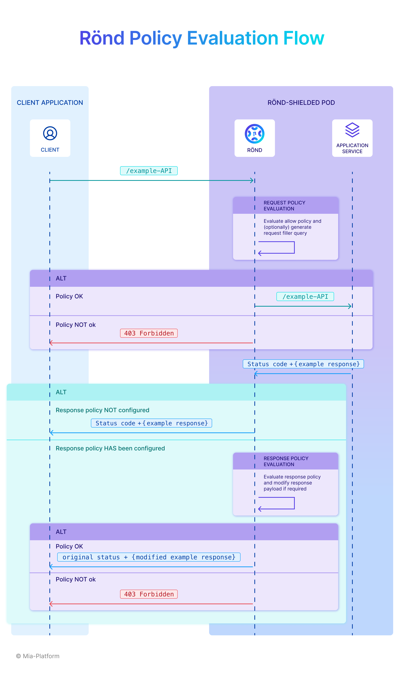

# Rönd Documentation

Welcome to the {{ site.title }} Documentation pages!

In this page you can find a brief introduction on Rönd and its workflow.

## Introduction

Rönd is an open-source lightweight Kubernetes sidecar container that defines security policies over your APIs. According to your needs, it can both run as a sidecar container in your Kubernetes cluster or as a standalone service: for further information see the [Configuration page](/docs/configuration).

Rönd uses [Open Policy Agent](https://www.openpolicyagent.org/) as security engine for validating authorization rules, and leverages Rego language for writing the security policies. Policies are centralized, so you do not have to embed them in your codebase.

Rönd is an authorization mechanism, but it also natively allows you to build an RBAC/ABAC solution by defining the concepts of Roles, Permissions, and User Groups as building blocks.

## Rönd workflow

Rönd intercepts all the incoming traffic, applies authorization rules and, if rules are passed, it forwards the traffic to your application service.

In the image below you can find a representation of the policy evaluation flow that Rönd executes for each API call it intercepts.

Now that you know what Rönd is and how it works, you are ready to [Getting started](/docs/getting-started).
